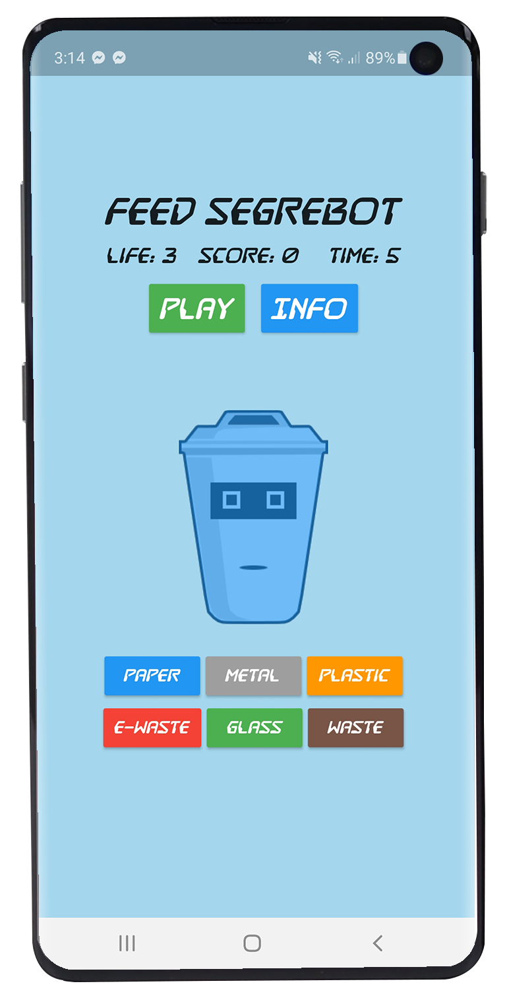
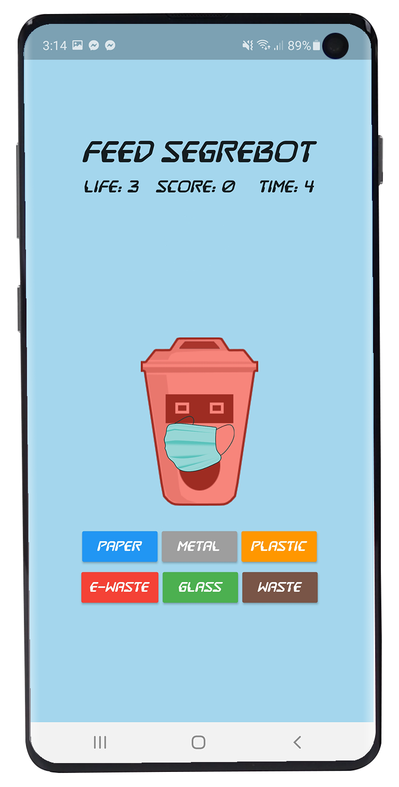
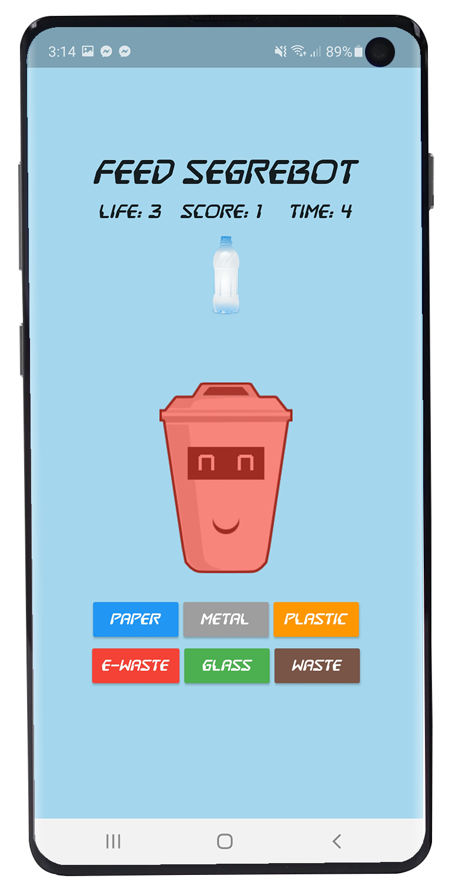
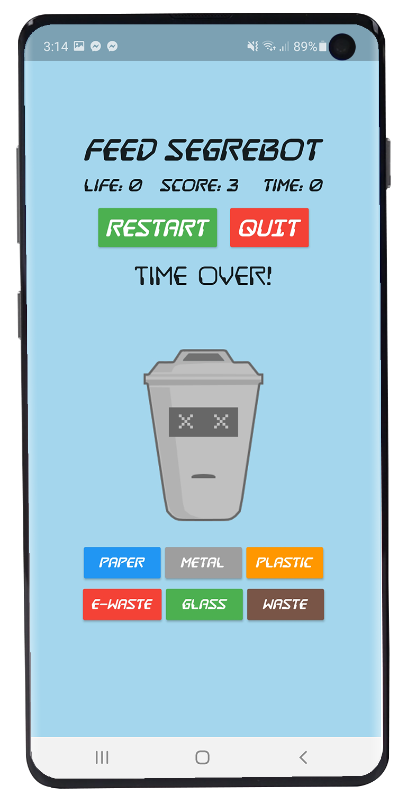

# Feed SegreBot

A simple Flutter game. An entry for Hack 20.

Theme: Save the planet, Eco / What we've learned during the pandemic

# Screenshots

<span>
	
	
	
</span><br/>
<span>
	
</span><br/>

## Setup

1. Clone the project repository.

```
git clone https://github.com/harveyjavier/feed_segrebot.git
```

2. From the project root, open feed_segrebot directory.

```
cd feed_segrebot
```

3. Run flutter.

```
flutter run
```

## Developer

### Harvz

Hi! I'm Harvz, the developer of this project. Let's get connected!

<a href="https://harveyjavier.github.io"></a>
<a href="https://play.google.com/store/apps/dev?id=4935714394750436171"></a>
<a href="https://www.linkedin.com/in/harvz/"></a>
<a href="https://www.facebook.com/harvzjavier"></a>
<a href="https://www.instagram.com/harvzjavier/"></a>

## License

This project is licensed under the MIT License - see the [LICENSE](LICENSE) file for details.